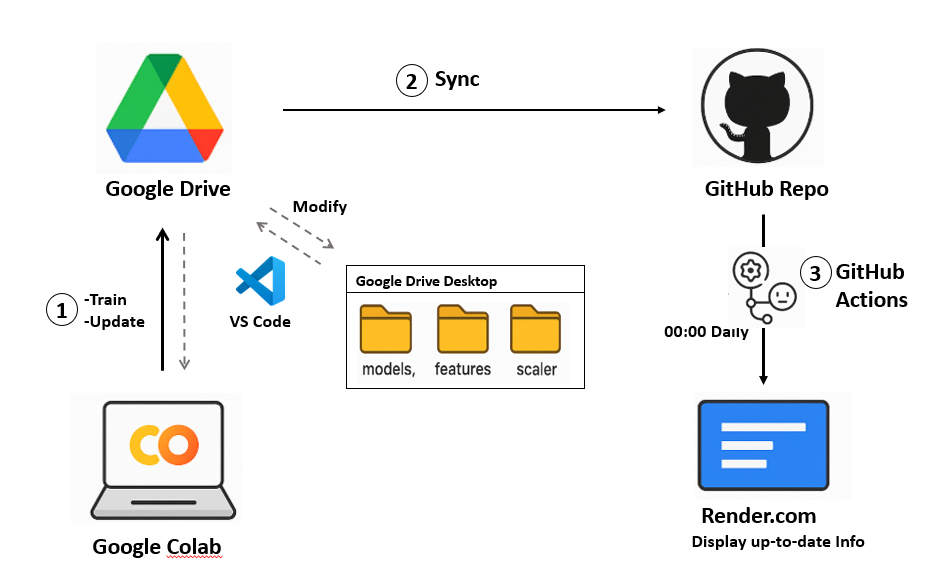
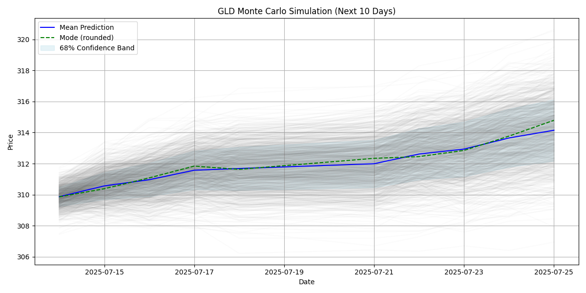
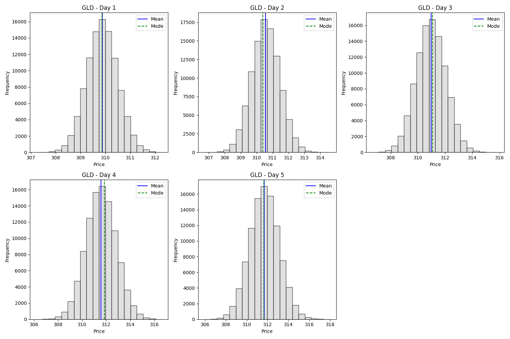
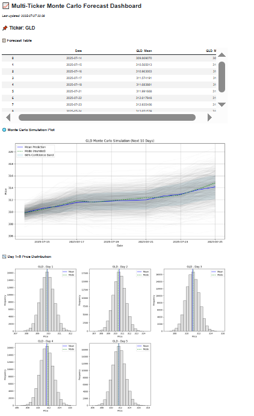

# LSTM Stock Forecasting Demo

This repository showcases a time-series forecasting pipeline for stock prices, using a two-layer LSTM model with PCA-based feature selection and VIX integration.  
It includes Monte Carlo simulations to estimate price uncertainty and a fully automated CI/CD deployment via GitHub Actions and Render.

> This is a **public demo repository** — the full codebase and trained models are kept private.  
> Contact me directly if you wish to request access.

---

## Features

- 2-layer LSTM model with log-return prediction
- PCA-based dimensionality reduction (95% explained variance)
- Technical indicators (RSI, momentum, volatility, etc.)
- Monte Carlo simulation for probabilistic forecasting
- Customised interactive modifiction through VS Code and Render.
- Automated daily pipeline (GitHub Actions)
- Interactive dashboard (Panel on Render)

---

## 🧱 Project Pipeline

---

## 📊 Demo Outputs

### 🔹 1. Monte Carlo Price Simulation Mode vs Mean(Day 1~10)

### 🔹 2. Monte Carlo Price Distribution (Day 1 - 5)

### 🔹 3. Deployed Dashboard Screenshot

---

## ⚙️ Automation Flow (CI/CD)

1. GitHub Actions runs `gld_prediction.py` daily
2. Fetches latest stock/VIX data → preprocess → predict
3. Outputs CSV + chart to `/Output/`
4. Touches `trigger.txt` → triggers auto-deploy on Render (Panel dashboard)

---

## 📎 Contact

For collaboration or access to the full codebase, please contact:

**Kai Yeh**  
Email: KaiYeh820206@gmail.com  
GitHub: [WayneKaiYeh](https://github.com/yourusername)

---

## 📄 License

This repository is shared under the [**Creative Commons BY-NC-ND 4.0 License**](https://creativecommons.org/licenses/by-nc-nd/4.0/).

- ❌ No commercial use
- ❌ No derivatives or redistribution
- ✅ Attribution required

All rights to the full code, trained models, and source notebooks are reserved.
